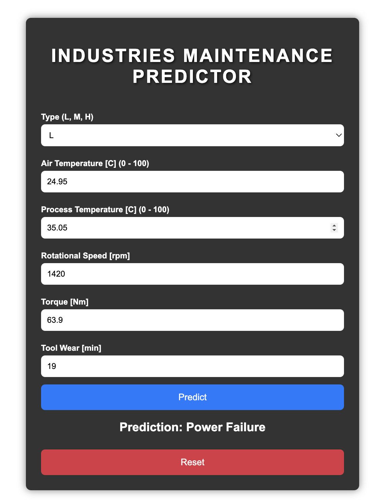

# 🔧 Predictive Maintenance for Industries

## 📌 Introduction

This project implements a **predictive maintenance system** for industrial machinery aimed at minimizing unexpected failures and reducing downtime. Unlike corrective maintenance (performed after a failure) and preventive maintenance (performed on a schedule), **predictive maintenance** uses machine learning to forecast failures before they occur, allowing for efficient and timely interventions.

By leveraging real-time operational data and advanced machine learning algorithms, this project helps industries reduce maintenance costs, avoid unnecessary repairs, and improve overall equipment efficiency.

---

## 📊 Dataset Description

- **Instances:** 10,000  
- **Features:** 14 (e.g., air temperature, process temperature, rotational speed, torque, tool wear)  
- **Target Variable:** `Failure Type` (categorical — indicates the type of failure)

---

## 🧹 Methodology

### 1. Data Cleaning
- No missing values.
- Removed non-informative columns: `UDI`, `Product ID`, and `Target`.
- Outliers in features like `rotational speed`, `torque`, and `tool wear` were handled using **IQR** method.

### 2. Feature Engineering
- Applied **ordinal encoding** to categorical variables like `Failure Type` and `Product ID`.
- Converted **Kelvin** to **Celsius** for temperature features for better interpretability.

### 3. Data Splitting
- Data split into **Training (80%)** and **Testing (20%)** sets.

---

## 🤖 Modeling Techniques

The following machine learning classification algorithms were applied:

- **Logistic Regression**
- **K-Nearest Neighbors (KNN)**
- **Random Forest Classifier**
- **Decision Tree Classifier**

---

## 📈 Results & Analysis

### Accuracy Before Tuning:

| Model                | Accuracy   |
|----------------------|------------|
| Random Forest        | 0.979990   |
| Decision Tree        | 0.972986   |
| KNN                  | 0.960980   |
| Logistic Regression  | 0.960980   |

### Accuracy After Hyperparameter Tuning:

| Model                | Best Parameters | Accuracy |
|----------------------|-----------------|----------|
| Random Forest        | `n_estimators=300`, `min_samples_split=2`, `min_samples_leaf=1`, `max_depth=None` | 0.981991 |
| Decision Tree        | `min_samples_split=10`, `min_samples_leaf=2`, `criterion='gini'` | 0.978489 |
| KNN                  | `weights='distance'`, `p=1`, `n_neighbors=12` | 0.963982 |
| Logistic Regression  | `solver='liblinear'`, `penalty='l1'`, `C=1438.45` | 0.965983 |

### Final Model Selection:

✅ **Random Forest Classifier** was selected for its highest post-tuning accuracy of **0.981991**.

---

## ✅ Conclusion

- The **Random Forest** model demonstrated the best performance in predicting machinery failures.
- The use of predictive maintenance significantly reduces downtime and unnecessary repair costs.
- ML-driven maintenance is a powerful asset for industries with critical machinery operations.

---

## 💡 Recommendations

1. **Real-Time Deployment:** Integrate the model into industrial IoT systems for continuous monitoring.
2. **Future Work:**
   - Experiment with **deep learning** models.
   - Use more complex and diverse datasets to improve generalizability.

---
